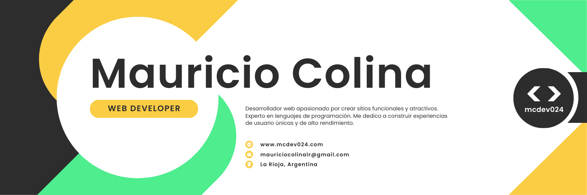

<h1 align="center"> Hola, soy <a href="https://github.com/mColina77">Mauricio [mcdev024]</a> 👋 </h1>

## Sobre mi
- 👀 Estoy interesado en programación web, me gusta la parte del diseño FrontEnd, pero también tengo curiosidad por todo lo que ocurre detrás, en el BackEnd
- 🌱 En constante aprendizaje: FullStack Developer, actualizando conocimientos y explorando nuevos caminos.
- 💞️ Busco colaborar en todo proyecto interesante, ¡no existen dificultades cuando el entusiasmo es superior!
- 📫 Puedes contactarme al e-mail mcolina77@gmail.com

<h4 align="center" color="yellow">"el fracaso es sólo un paso en el camino hacia el éxito" </h4>

## Skills

         

 

#### Tools and Technologies
&nbsp;
&nbsp;
&nbsp;

 

#### Connect with me:

   

 

   

<!---
mColina77/mColina77 is a ✨ special ✨ repository because its `README.md` (this file) appears on your GitHub profile.
You can click the Preview link to take a look at your changes.
--->
